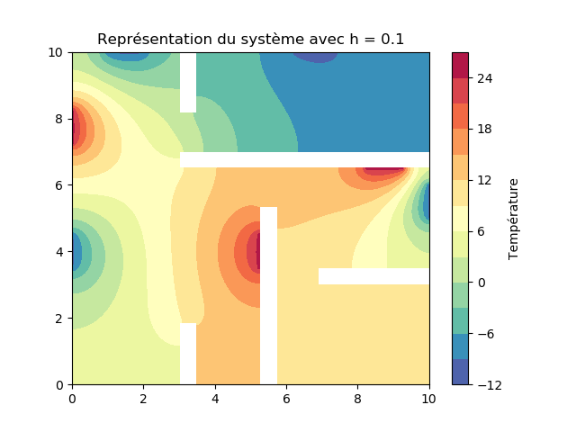

# Projet MEF (Maillage éléments finis)
## Introduction
Ce répertoire git contient le travail de : *Bartolomé Heulin* et *Nasrine Bahria*, élèves en 5ème année d'école d'ingénieurs en spécialité mathématiques appliquées et informatique. Le projet consiste à mettre en place un solveur de la méthode des éléments finis en `python`.  
Le problème consiste à modéliser la diffusion de la chaleur dans un appartement contenant des radiateurs et des fenêtres.
L'appartement est comme suit :  
  
## Le problème
Le problème est noté comme suit :  
  
On peut voir qu'en écrivant ce système sous forme variationelle on obtient :  
  
Avec :  
{:height="67px" width="272px"}.  
## Implémentation  
On peut remarquer plusieurs choses :  
* Pas besoin de matrice de Masse : A = D (matrice de rigidité)  
* Deux conditions de Dirichlet, une sur les fenêtres et une sur les radiateurs  
* Séparer notre domaine en 3 parties/tags (pièce, fenêtre, radiateur)
* Les conditions de Dirichlet se feront sur les tags fenêtre et radiateur
* La matrice de rigidité sera faite par rapport au tag des pièces
## Détails sur les codes
Le git se sépare en plusieurs dossiers :  
* __mesh__ : contenant les fichiers msh avec différentes finesse de maillage
* __script__ : contenant les fichiers `.py`
  * __solveur.py__ : notre code principal pour l'exécution
  * __triangle.py__ : la classe triangle avec les fonctions correspondantes  
  * __segment.py__ : la classe segment avec les fonctions correspondantes  
  * __point.py__ : la classe point avec les fonctions correspondantes  
  * __triplet.py__ : la classe triplet avec les fonctions correspondantes  
  * __mesh.py__ : la classe mesh qui utilise les classes triangle, segment et point  
  * __assembly.py__ : la classe qui s'occupe des assemblages de matrices de masse, rigidité, second membre
* __res__ : contenant les images de nos précédentes exécutions
## Exécution du code
Pour exécuter notre solveur, il faut aller dans le dossier script (`cd script`) puis taper la commande suivante : `python3 solveur.py finesseMaillage`  
avec `finesseMaillage` qui peut prendre les valeurs {0.1, 1, 100}  
## Nos résultats
Pour `finesseMaillage = 0.1`, nous obtenons :

Pour `finesseMaillage = 1`, nous obtenons :

Pour `finesseMaillage = 100`, nous obtenons :
      
